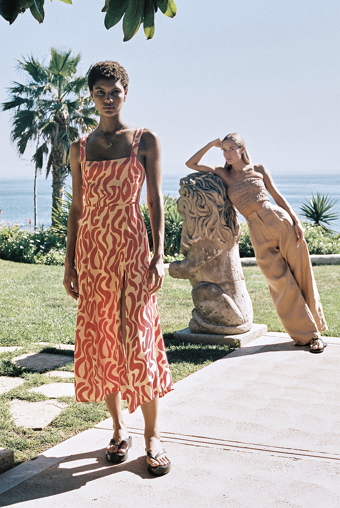

Olena Grebenetska – Retouch Portfolio
web site: https://new.olenaretouch.com/index.html

Static portfolio website for showcasing the retouching work of Olena Grebenetska.
Built with plain HTML, CSS and JavaScript, no frameworks.

The site focuses on clean layout, large imagery and simple navigation, similar to minimal agency / editorial portfolios.

⸻

Features
	•	Responsive layout
	•	Single-column layout on mobile, multi-column grid on larger screens.
	•	Simple top navigation
	•	Logo + menu with links to:
	•	Home (grid with works)
	•	Clients
	•	About & Contact
	•	Instagram
	•	Burger button on small screens.
	•	Project thumbnails use loading="lazy" to reduce initial load time.
	•	Per-series fullscreen gallery
	•	Clicking a thumbnail on the home page opens gallery.html with:
	•	The exact image/series the user clicked.
	•	Navigation arrows for moving within that series.
	•	Keyboard controls:
	•	← / → – previous / next image
	•	Esc – close gallery and return to the home page
	•	Close button (×) in the top right corner.
	•	Clients page
	•	A centered, single-column list of clients.
	•	About & Contact page
	•	Short bio and contact information, centered content.
	•	Accessible details
	•	Semantic HTML (header, main, footer, nav, figure, figcaption).
	•	Skip link to allow jumping directly to the main content.
	•	alt text for all images.

⸻

Tech Stack
	•	HTML5 – structure and content
	•	CSS3 – layout and styling (no framework)
	•	Vanilla JavaScript
	•	js/app.js – navigation, lightbox logic on the main page, lazy loading helpers
	•	js/gallery.js – fullscreen gallery logic and keyboard navigation

No build tools, bundlers or backend – everything is static.

⸻

Project Structure
.
├── index.html           # Home page – grid of works (series thumbnails)
├── gallery.html         # Fullscreen gallery for a single series
├── clients.html         # List of clients
├── about-contact.html   # About & contact information
├── css/
│   └── style.css        # Main stylesheet
├── js/
│   ├── app.js           # Navigation, lightbox & general scripts
│   └── gallery.js       # Gallery page logic (series navigation)
└── img/
    ├── look0/           # Images for series "look0"
    ├── look1/
    ├── look2/
    └── ...              # etc. for other series

How It Works

1. Linking a thumbnail to a series

On index.html, every work in the grid is a link to gallery.html with query parameters:
<a class="work-card"
   href="gallery.html?series=look12&img=0"
   aria-label="Case: Example Project">
  <figure class="work-figure">
    
    <figcaption class="work-caption">
      Project title
    </figcaption>
  </figure>
</a>
	•	series – key of the series (must match a key in SERIES in gallery.js, e.g. look12)
	•	img – index of the starting image inside that series (usually 0)
2. Defining image series (gallery.js)

In js/gallery.js there is a SERIES object:
const SERIES = {
  look0: [
    "img/look0/Hair_Editorial-5120.jpg",
    "img/look0/Hair_Editorial-002.jpg",
    // ...
  ],
  look1: [
    "img/look1/IMAGE 1.jpg",
    // ...
  ],
  // etc...
};
When the user opens gallery.html?series=look0&img=0:
	1.	gallery.js reads series=look0 and img=0 from the URL.
	2.	Finds SERIES["look0"] and shows the corresponding image.
	3.	Next / Previous arrows and keyboard arrows loop only inside that series.

If series is missing or unknown, the code falls back to a global ALL_IMAGES list.

Credits
	•	Retouching & concept: Olena Grebenetska
	•	Photography: Various photographers (credited per project on the site)
	•	Design & code: Custom HTML/CSS/JS

⸻

License

The code can be reused and adapted for personal or educational purposes.
All images are © Olena Grebenetska and respective photographers and may not be copied or reused without explicit permission.

